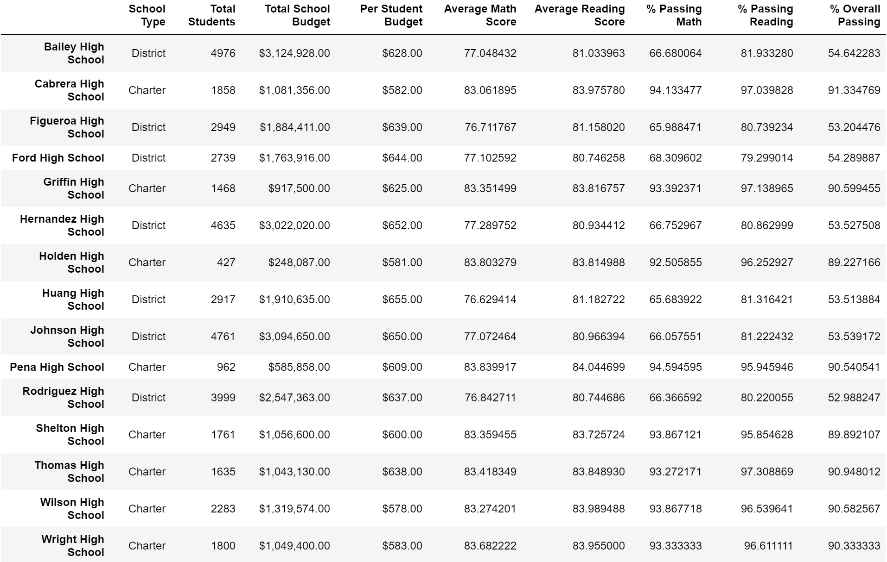

# School District Analysis

## Overview of District Analysis
### Purpose of Analysis
The purpose of this analysis was to analyze and review student funding and standardized testing data for a specific school district containing 15 schools.  The data needed to be first cleaned, and then organized to showcase trends in school  performance.  The final analysis is intended for the school board, and other school administration to help inform decisions about school budget allotments.  Specifically for this analysis, the following information was aggregated from the data:
- District Summary
- School Summary
- Top and Bottom 5 Schools based on overall passing rate
- Average Math and Reading scores by grade level for each school
- Scores by School Spending, School Size, and School Type

### Resources
- Data Sources: schools_complete.csv, students_complete_csv
- Software: Python 3.8.8, Jupyter notebook 6.4.0, Jupyter lab 3.0.16
- Python libraries: numpy, pandas

## School District Summary

### Data Cleaning
The original students_complete.csv file included several Prefixes and Suffixes that made it difficult to work with the given data.  I employed many different methods to quantify the following list of prefixes and suffixes, and the code below to remove those from the Series of Student Names.

```
prefixes_suffixes = ["Dr. ", "Mr. ","Ms. ", "Mrs. ", "Miss ", " MD", " DDS", " DVM", " PhD"]

for word in prefixes_suffixes:
    student_data_df["student_name"] = student_data_df["student_name"].str.replace(word,"")
```
### Summary
The following is the Summary by School for the complete set of data.


### Thomas High School
The schoolboard was notified that the students_complete.csv file showed evidence of academic dishonesty, specifically regarding the testing data for ninth grade students at Thomas High School.  Using '''df.loc''' methods in Pandas, I changed the 9th grade student data to NaN (not a number) and reran the analysis with only the 10th - 12th grade student data from Thomas High School.  The updated Summary by School data looks like the following.  The THomas High School row is yellow to highlight the changes to the math and reading passing percentages.


The following list addresses the changes to the data after excluding Thomas High School's 9th grade:
- 461 9th grade students at Thomas High School were removed
- The Average Math Score decreased from 83.41 to 83.35
- The Average Reading Score increased from 83.84 to 83.90
- There was a negligible (<.1%) change in % Passing Mathath
- There was a negligible (<.3%) change in % Passing Reading
- The overall passing percentage changed by less than 1/2 of 1 percentage point

### Conclusion
Four major changes occurred after omitting the Thomas High School 9th grade class: fewer overall students were counted in the data, 461 fewer students were counted at Thomas High School, small changes in the average math and reading scores, and small changes in the math, reading and overall percentage pass rates.

The changes for both math and reading, including average scores and passing rates, were negligible.  I would not rule out academic dishonesty, the but effect on the overall school performance is trivial.
